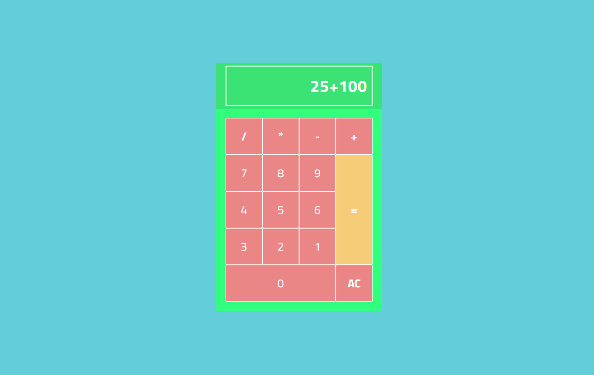

# 🎉 Calculadora



Projeto da calculdadora para **prática** no desenvolvimento de aplicações utilizando a biblioteca [React](https://pt-br.reactjs.org/).

### Online

https://lubomfim-calc-react.netlify.app/

## 🚀 Tecnologias utilizadas

- [HTML](https://developer.mozilla.org/pt-BR/docs/Web/HTML)
- [CSS](https://developer.mozilla.org/pt-BR/docs/Web/CSS)
- [Javascript](https://developer.mozilla.org/pt-BR/docs/Web/JavaScript) [(React)](https://pt-br.reactjs.org/)

## ✨ Atualizações / Etapas do Desenvolvimento

- [x] Iniciando o projeto com "create-react-app";
- [x] Definindo a estrutura e design;

## Instalação

Para rodar essa aplicação, é necessário que tenha instalado o [Node e NPM](https://nodejs.org/en/), o NPM vem junto na instalação do Node.

```javascript

// Abra o terminal e digite

git clone git@github.com:lubomfim/calculadora-react.git

// E após clonar o reposítorio, será necessário instalar as dependências com o comando

npm install

// Com a aplicação clonada e suas dependências instaladas,
// você pode executar o comando abaixo e iniciar a aplicação:

npm start

// Agora você conseguirá acessar a aplicação pelo http://localhost:3000/

```
